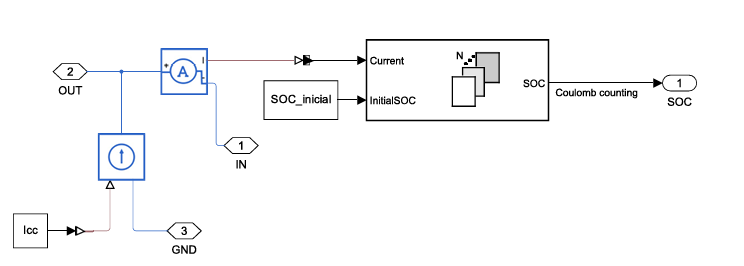
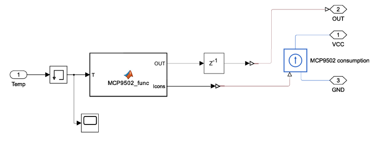
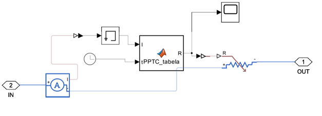
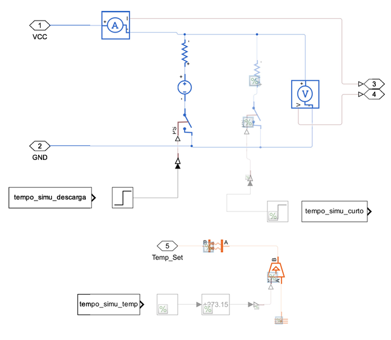
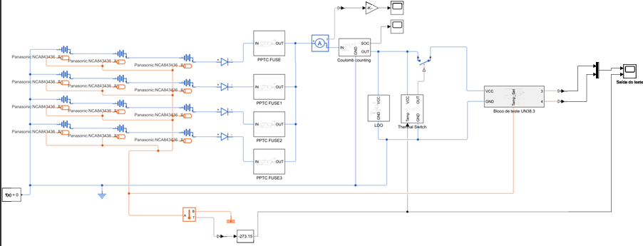
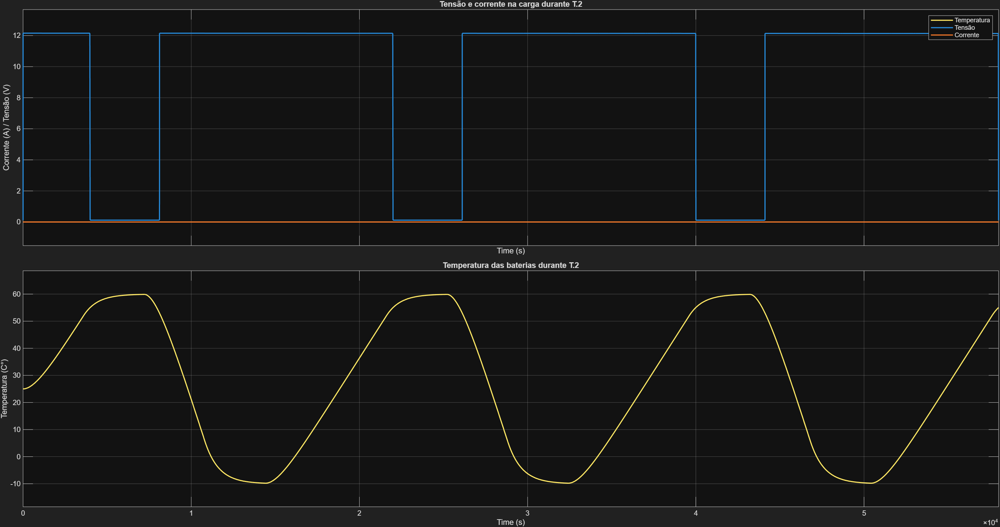
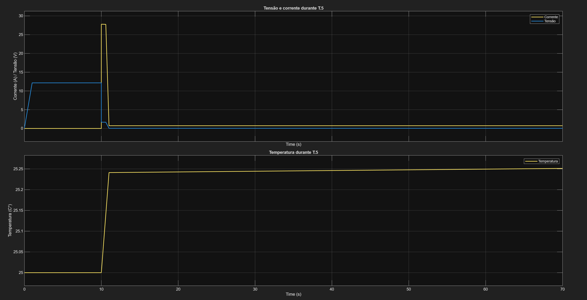
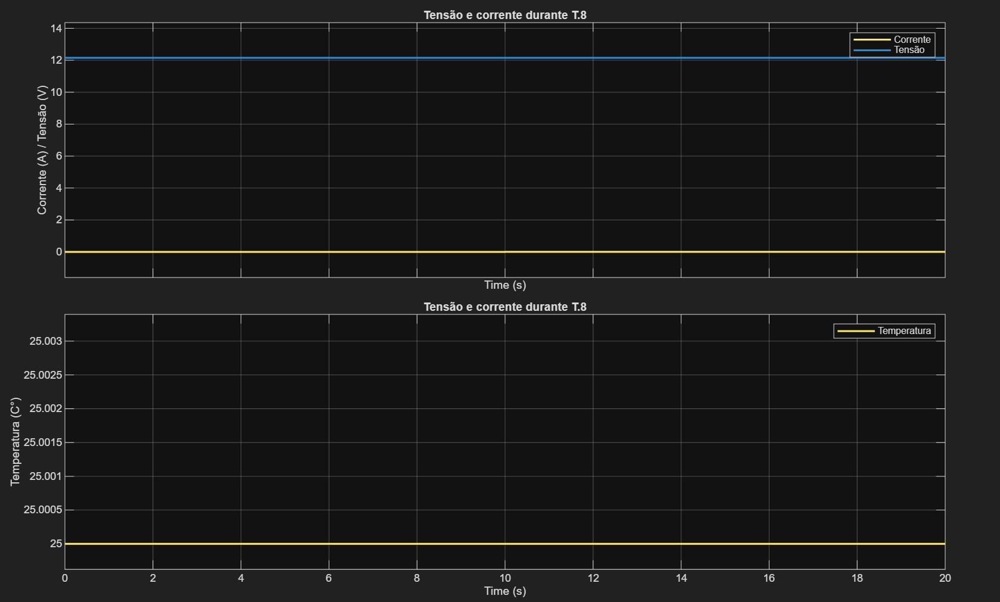

# BMS_Primary_Batteries

Esse repositório terá como finalidade reunir arquivos de apoio, tais como modelos de simulação, códigos, tabelas de parâmetros, esquemáticos, resultados intermediários e demais documentos utilizados durante a elaboração do estudo.

# Sumário

1. [Dispositivos de referência](#dispositivos-de-referência)
   1. [Proteção contra autocarregamento](#proteção-contra-autocarregamento)
   2. [Contador de coulomb](#contador-de-coulomb)
   3. [Proteção contra sobreaquecimento](#proteção-contra-sobreaquecimento)
   4. [Proteção contra sobrecarga](#proteção-contra-sobrecarga)

2. [Modelo de simulação da bateria](#modelo-de-simulação-da-bateria)
   1. [Funcionamento do modelo equivalente no Simulink](#funcionamento-do-modelo-equivalente-no-simulink)
   2. [Porta térmica e modelagem da temperatura](#porta-térmica-e-modelagem-da-temperatura)
   3. [Célula de referência](#célula-de-referência)
   4. [Configuração simulada](#configuração-simulada)
   5. [Arquivos e referências relacionados](#arquivos-e-referências-relacionados)

3. [Modelos das proteções](#modelos-das-proteções)
   1. [Modelo da proteção contra autocarregamento](#modelo-da-proteção-contra-autocarregamento)
   2. [Modelo do Coulomb Counter](#modelo-do-coulomb-counter)
   3. [Modelo da proteção contra sobreaquecimento](#modelo-da-proteção-contra-sobreaquecimento)
   4. [Modelo da proteção contra sobrecarga](#modelo-da-proteção-contra-sobrecarga)
   5. [Bloco de simulação dos testes UN 38.3](#bloco-de-simulação-dos-testes-un-383)

4. [Modelo completo](#modelo-completo)

 

# Dispositivos de referência.

## Proteção contra autocarregamento 
No projeto, foi utilizado o diodo Schottky [RBS2MM40B](Datasheets/RBS2MM40B.pdf), da ROHM, com a função de impedir a circulação de corrente entre células quando suas tensões estiverem desniveladas. Para isso, é necessário utilizar um diodo em cada ramo série do conjunto, evitando o autocarregamento ou a transferência indesejada de energia entre ramos com diferentes potenciais.

Como a validação foi realizada por simulação, o principal parâmetro considerado foi a tensão direta do diodo, utilizada para representar a queda de tensão durante a condução. Para o RBS2MM40B, o datasheet indica uma queda de tensão direta típica de 0,37 V para corrente de 2 A.
## Contador de coulomb
 No projeto, foi utilizado o Coulomb Counter [LTC2959](Datasheets/LTC2959.pdf), selecionado por ser um medidor de carga de ultrabaixo consumo. Segundo o datasheet, o componente possui faixa de alimentação de 1,8 V a 60 V, mede carga, tensão, corrente e temperatura, e apresenta precisão de 1% para tensão, corrente e carga. Além disso, sua corrente de alimentação pode ficar abaixo de 1 µA com a medição de Coulomb ativa e o ADC desligado.
 
Na simulação, o consumo do circuito foi representado por uma fonte de corrente drenando 8 mA do conjunto de baterias, permitindo considerar seu impacto energético. Entretanto, os erros associados à medição foram desconsiderados, sendo utilizado o medidor de coulomb ideal do simulink, assim o componente acabou sendo modelado apenas pelo consumo elétrico no sistema.
## Proteção contra sobreaquecimento 
No projeto, foi utilizado o thermal switch [MCP9502](Datasheets/MCP9501.pdf) como elemento de proteção térmica do conjunto de baterias. A escolha desse componente está associada ao seu baixo consumo e à simplicidade de implementação, pois ele possui limiar de temperatura definido de fábrica e por conta de ser do tipo push-pull, não exige tensões externas para o acionamento da saída. No circuito proposto, foi considerada a versão com atuação em temperatura elevada, configurada para TSET = 55 °C e histerese de 2 °C. Segundo o datasheet, o MCP9502 opera entre 2,7 V e 5,5 V e apresenta corrente típica de alimentação de 25 µA. 

Para alimentar o thermal switch, foi considerado o uso de um LDO, responsável por fornecer uma tensão de 3,3 V ao componente. Na simulação, o consumo associado ao LDO foi representado por uma fonte de corrente drenando corrente do conjunto de baterias, sem modelar internamente os detalhes elétricos do regulador.

Além disso, o thermal switch foi representado considerando dois estados de consumo: um consumo quando o dispositivo se encontra desativado e outro quando está ativado. Esses dois valores foram inseridos na simulação por meio de fontes de corrente, permitindo representar a variação do consumo do circuito de proteção térmica conforme sua condição de operação.

 
## Proteção contra sobrecarga
No projeto, foi utilizado um fusível rearmável do tipo PPTC da série 0ZCJ, aplicado como proteção contra corrente excessiva e condição de curto-circuito externo. A escolha desse tipo de componente está associada à sua capacidade de aumentar significativamente a resistência quando a corrente ultrapassa o limite de atuação, reduzindo a corrente no circuito sem exigir substituição após a remoção da falha.

Segundo o datasheet do [0ZCJ0110AF2C](Datasheets/0ZCJ0110AF2C.pdf), esses dispositivos possuem faixa de corrente de retenção entre 50 mA e 2 A, faixa de temperatura de operação de -40 °C a 85 °C e são destinados a aplicações de proteção contra sobrecorrente. Na simulação, o PPTC foi representado por uma resistência variável, alternando entre uma resistência inicial baixa e uma resistência elevada após a atuação, permitindo demonstrar a limitação da corrente durante o curto-circuito. Os valores de resistência foram calculados a partir das fórmulas do datasheet.

# Modelo de simulação da bateria

## Funcionamento do modelo equivalente no Simulink

O modelo da bateria foi desenvolvido no MATLAB/Simulink utilizando a biblioteca Simscape. A bateria foi representada por meio de um modelo elétrico equivalente, no qual o comportamento da célula é aproximado por uma fonte de tensão dependente do estado de carga, uma resistência interna e elementos dinâmicos associados à resposta transitória da bateria.

Esse tipo de modelo é útil para simulações em nível de sistema, pois permite representar o comportamento elétrico da bateria sem a necessidade de modelar diretamente todos os fenômenos eletroquímicos internos da célula. No Simscape, modelos equivalentes de bateria podem representar a tensão terminal a partir de parâmetros como estado de carga, resistência interna, temperatura e, dependendo da configuração utilizada, ramos RC associados à dinâmica de polarização da célula. A própria documentação da MathWorks descreve os modelos equivalentes como estruturas baseadas em resistores, capacitores e fontes de tensão para reproduzir o comportamento dinâmico de uma célula, sendo adequados para projeto de BMS e simulações em nível de sistema.

No modelo utilizado neste projeto, a bateria foi configurada para representar uma associação 3S4P. Assim, cada célula contribui para o comportamento elétrico do conjunto, enquanto a associação em série eleva a tensão total e a associação em paralelo aumenta a capacidade disponível. A tensão terminal do conjunto varia conforme a descarga, o estado de carga e a queda de tensão provocada pela resistência interna.

Como o objetivo do estudo é avaliar proteções para baterias primárias, o modelo foi utilizado apenas em condição de descarga. As partes associadas ao processo de carregamento não foram consideradas, mesmo a célula de referência sendo uma célula recarregável. Dessa forma, o modelo foi empregado como uma aproximação elétrica para permitir a validação das proteções propostas em condições de falha e operação.

## Porta térmica e modelagem da temperatura

Além do comportamento elétrico, o modelo também utiliza a interface térmica da bateria. No Simscape, alguns blocos de bateria permitem habilitar a porta térmica, normalmente identificada como porta `H`, para conectar a célula a uma rede térmica. Essa porta permite representar os efeitos térmicos associados à bateria e sua interação com o ambiente ou com outros elementos térmicos do sistema. A documentação da MathWorks indica que, ao habilitar a porta térmica, ela deve ser conectada à rede térmica do modelo, permitindo representar baterias com sensor de temperatura ou validar algoritmos de estimação térmica. 

Neste projeto, as interfaces térmicas das células foram conectadas entre si, formando uma rede térmica comum para o conjunto de baterias. Essa abordagem foi adotada para simplificar a representação térmica do pack, considerando que as células estão submetidas a uma condição térmica equivalente durante a simulação.

Para representar a massa térmica do conjunto, foram utilizados os dados físicos das células, como massa e propriedades térmicas adotadas no modelo. A partir desses valores, foram criadas as massas térmicas responsáveis por armazenar energia térmica durante o aquecimento. No Simscape, a massa térmica associada à porta térmica representa a energia necessária para elevar a temperatura do elemento em um grau, o que permite aproximar o comportamento térmico do conjunto durante os ensaios simulados.

Dessa forma, a variação de temperatura aplicada ao conjunto de baterias não atua apenas como um sinal isolado, mas como parte de uma rede térmica conectada às células. Essa configuração permite avaliar a atuação da proteção térmica, como o thermal switch MCP9502, a partir da temperatura representada no pack durante a simulação.

Para modelar as células/bateria primária, foi utilizado um modelo de circuito elétrico equivalente de bateria no ambiente MATLAB/Simulink com a biblioteca Simscape. Devido à dificuldade de encontrar modelos específicos de células primárias disponíveis para simulação, foi adotada como referência uma célula comercial de íon-lítio Panasonic NCA843436, utilizando seus dados elétricos principais para parametrizar o modelo.

A célula Panasonic NCA843436 é uma bateria prismática de íon-lítio com química NCA, tensão nominal de 3,6 V e capacidade típica de 1,3 Ah. Segundo o datasheet, sua capacidade mínima é de 1,275 Ah, com massa aproximada de 23 g. Essa célula foi utilizada como referência por possuir modelo de simulção dentro do Simulink com parte elétrica e de temperatura.

A configuração adotada no estudo foi de 3 células em série e 4 ramos em paralelo, formando um conjunto 3S4P. Dessa forma, a tensão nominal aproximada do conjunto é de 10,8 V, enquanto a capacidade equivalente considerada é de aproximadamente 5,2 Ah, obtida pela associação de quatro ramos em paralelo.

Embora a célula de referência seja recarregável, o estudo tem foco em baterias primárias. Por esse motivo, as partes do modelo relacionadas ao carregamento não foram utilizadas. A bateria foi analisada apenas em condições de descarga e falha, de forma compatível com a proposta de avaliar circuitos de proteção para baterias não recarregáveis.

### Célula de referência

| Parâmetro | Valor |
|---|---:|
| Modelo | Panasonic NCA843436 |
| Tipo | Célula prismática de íon-lítio |
| Química | NCA |
| Tensão nominal | 3,6 V |
| Capacidade mínima | 1,275 Ah |
| Capacidade típica | 1,3 Ah |
| Massa aproximada | 23 g |
| Aplicação no estudo | Referência para parametrização do modelo equivalente |

### Configuração simulada

| Parâmetro | Valor |
|---|---:|
| Configuração | 3S4P |
| Número total de células | 12 |
| Células em série | 3 |
| Ramos em paralelo | 4 |
| Tensão nominal aproximada do conjunto | 10,8 V |
| Capacidade equivalente aproximada | 5,2 Ah |

### Arquivos e referências relacionados

| Tipo de arquivo | Referência |
|---|---|
| Datasheet da célula | [NCA843436](Datasheets/nca843436.pdf) |
| Referência do modelo MATLAB/Simscape | [Battery (Table-Based) — MathWorks](https://www.mathworks.com/help/sps/ref/batterytablebased.html) |
| Referência sobre modelo equivalente de bateria | [Battery Equivalent Circuit — MathWorks](https://www.mathworks.com/help/simscape-battery/ref/batteryequivalentcircuit.html) |

### Imagem do modelo

# Modelos das proteções

Esta seção descreve os modelos simplificados utilizados para representar os circuitos de proteção na simulação. Foram considerados apenas os parâmetros relevantes para demonstrar a atuação de cada proteção no modelo do conjunto de baterias.

Os parâmetros utilizados estão concentrados no arquivo:

[Parâmetros dos componentes](Matlab_Model/parametros_componentes.m)

---

## Modelo da proteção contra autocarregamento

A proteção contra autocarregamento foi representada pelo diodo Schottky RBS2MM40BTR. No projeto, esse componente tem a função de impedir a circulação de corrente entre células ou ramos quando suas tensões estiverem desniveladas, evitando a transferência indesejada de energia entre eles.

Na simulação, o diodo foi modelado de forma simplificada. O principal parâmetro considerado foi a tensão direta, utilizada para representar a queda de tensão durante a condução. Os demais efeitos do componente, como variações térmicas, corrente de fuga e comportamento dinâmico, não foram detalhados no modelo.

| Parâmetro utilizado | Variável | Valor | Unidade | Função no modelo |
|---|---:|---:|---:|---|
| Tensão direta do diodo | `V_direta` | 0,37 | V | Representa a queda de tensão durante a condução direta |

Referência utilizada:

[RBS2MM40B Datasheet](Datasheets/RBS2MM40B.pdf)

---

## Modelo do Coulomb Counter

O Coulomb Counter LTC2959 foi considerado no projeto como referência para a medição de carga consumida pelo conjunto de baterias. Entretanto, na simulação, o componente não foi modelado internamente.

A contagem de carga foi representada por um medidor ideal do Simulink. Dessa forma, os erros de medição associados ao componente real foram desconsiderados. Para representar o impacto energético do circuito, foi inserida uma fonte de corrente drenando o consumo do Coulomb Counter do conjunto de baterias.

| Parâmetro utilizado | Variável | Valor | Unidade | Função no modelo |
|---|---:|---:|---:|---|
| Corrente de consumo do Coulomb Counter | `Icc` | -0,000008 | A | Representa a corrente drenada pelo circuito de medição |
| Corrente equivalente | - | 8 | µA | Valor equivalente em microampères |

O sinal negativo foi utilizado para indicar que a corrente está sendo drenada da bateria.

### Imagem do modelo

Referência utilizada:

[LTC2959 Datasheet](Datasheets/LTC2959.pdf)

---

## Modelo da proteção contra sobreaquecimento

A proteção contra sobreaquecimento foi representada pelo thermal switch MCP9502. Esse componente foi escolhido por possuir baixo consumo, limiar de temperatura definido de fábrica e saída do tipo push-pull.

Na simulação, o MCP9502 foi modelado como uma chave térmica baseada na comparação da temperatura do conjunto de baterias. Quando a temperatura atinge o valor de atuação, a saída do componente muda de estado, representando a ativação da proteção térmica. A histerese foi incluída para evitar chaveamentos indevidos próximos ao ponto de atuação.

A alimentação do componente foi definida em 3,3 V. O consumo do thermal switch foi representado por uma fonte de corrente. O LDO utilizado para alimentar o componente também não foi modelado internamente, sendo representado apenas pelo seu consumo.

| Parâmetro utilizado | Variável | Valor | Unidade | Função no modelo |
|---|---:|---:|---:|---|
| Modelo do componente | `modelo_exato` | MCP9502 | - | Identificação do componente utilizado |
| Tensão de alimentação | `VDD` | 3,3 | V | Alimentação do thermal switch |
| Temperatura de atuação | `TSET` | 55 | °C | Temperatura em que a proteção atua |
| Histerese | `HYST` | 2 | °C | Evita comutação indevida próxima ao limite |
| Corrente de consumo do CI | `IDD` | 25e-6 | A | Consumo do MCP9502 |
| Corrente de consumo equivalente | - | 25 | µA | Valor equivalente em microampères |
| Corrente de carga na saída | `Iload` | 0 | A | Corrente considerada na saída do componente |
| Saída em condição normal | `OUT_normal` | 0 | V | Nível de saída antes da atuação |
| Saída com proteção ativa | `OUT_trip` | 3,3 | V | Nível de saída após atuação |
| Tipo de saída | `tipo_saida` | push-pull | - | Configuração de saída do MCP9502 |
| Tipo de acionamento | `tipo_acionamento` | hot | - | Atuação por temperatura elevada |
| Corrente de consumo do LDO | `Ildo` | -0,00007 | A | Consumo do regulador usado para alimentar o thermal switch |
| Corrente equivalente do LDO | - | 70 | µA | Valor equivalente em microampères |

O sinal negativo em `Ildo` indica que a corrente está sendo drenada do conjunto de baterias.

### Imagem do modelo

Referência utilizada:

[MCP9502 Datasheet](Datasheets/MCP9501.pdf)

---

## Modelo da proteção contra sobrecarga

A proteção contra sobrecarga foi representada por um fusível rearmável do tipo PPTC. Esse componente foi utilizado para limitar a corrente em situações de sobrecorrente ou curto-circuito externo.

Na simulação, o PPTC foi modelado como uma resistência variável. Em condição normal, o componente apresenta baixa resistência. Quando ocorre a atuação da proteção, sua resistência aumenta significativamente, reduzindo a corrente no circuito.

A atuação do modelo foi baseada em uma tabela corrente-tempo extraída da curva do datasheet. Essa tabela relaciona o valor da corrente com o tempo necessário para o fusível atuar. Assim, o modelo permite representar o atraso de atuação característico do PPTC.

| Parâmetro utilizado | Variável | Valor | Unidade | Função no modelo |
|---|---:|---:|---:|---|
| Resistência inicial | `R_inicial` | 0,18 | Ω | Resistência antes da atuação |
| Resistência após atuação | `R_trip` | 64,8 | Ω | Resistência considerada após o disparo da proteção |
| Tabela de corrente | `I_table` | vetor | A | Valores de corrente extraídos da curva corrente-tempo |
| Tabela de tempo | `t_table` | vetor | s | Tempos de atuação associados à corrente |
| Corrente mínima da tabela | `I_min_tabela` | 1,6306 | A | Menor corrente considerada na curva de atuação |
| Corrente máxima da tabela | `I_max_tabela` | 16,1511 | A | Maior corrente considerada na curva de atuação |
| Tempo mínimo da tabela | `t_min_tabela` | 0,0111 | s | Menor tempo de atuação considerado |
| Tempo máximo da tabela | `t_max_tabela` | 93,2291 | s | Maior tempo de atuação considerado |

Referência utilizada:

[0ZCJ0110AF2C Datasheet](Datasheets/0ZCJ0110AF2C.pdf)

### Imagem do modelo

## Bloco de simulação dos testes UN 38.3

O bloco de simulação dos testes UN 38.3 foi desenvolvido para aplicar, em um mesmo ambiente, as condições associadas aos ensaios de descarga, curto-circuito e variação térmica no conjunto de baterias. A estrutura do bloco permite controlar o instante em que cada condição é aplicada e observar a resposta elétrica e térmica do sistema.

A alimentação principal do circuito é conectada pelos terminais `VCC` e `GND`. Na entrada do circuito, a corrente é monitorada por um sensor, permitindo acompanhar o comportamento do conjunto durante a operação normal e durante as condições de falha. A tensão nos terminais também é medida para verificar a resposta do sistema após a atuação das proteções.

O bloco utiliza sinais de controle temporizados para acionar diferentes condições de teste. O sinal `tempo_simu_descarga` define o instante em que a carga principal é conectada ao circuito, iniciando a descarga do conjunto de baterias. Após esse acionamento, espera-se que a bateria forneça corrente para a carga e que a tensão terminal varie de acordo com o comportamento do modelo.

O sinal `tempo_simu_curto` é utilizado para inserir a condição de curto-circuito externo. Quando esse sinal é ativado, o caminho de menor resistência é conectado ao circuito, provocando aumento da corrente. Nessa condição, espera-se que a proteção contra sobrecorrente atue, elevando a resistência equivalente do caminho protegido e limitando a corrente que circula pelo sistema.

A parte térmica do bloco é comandada pelo sinal `tempo_simu_temp`. Esse sinal aplica a condição de aquecimento ao modelo térmico do conjunto de baterias. A temperatura é aplicada à interface térmica do sistema, permitindo avaliar a resposta da proteção térmica. Quando a temperatura atinge o limite definido, espera-se que a proteção altere seu estado e interrompa ou bloqueie a condição de operação definida no circuito.

De forma geral, o bloco deve permitir observar três comportamentos principais:

| Condição aplicada | O que deve acontecer |
|---|---|
| Início da descarga | A carga é conectada e a bateria passa a fornecer corrente ao circuito |
| Aplicação do curto-circuito | A corrente aumenta e a proteção contra sobrecorrente deve limitar esse valor |
| Elevação da temperatura | A temperatura do conjunto aumenta e a proteção térmica deve atuar ao atingir o limite definido |
| Monitoramento de tensão e corrente | Os sensores devem indicar a resposta do conjunto antes, durante e após cada condição aplicada |

A imagem abaixo representa o bloco utilizado para aplicar essas condições de teste no modelo.

Esse bloco foi utilizado como ambiente de simulação para verificar se as proteções respondem corretamente às condições impostas. A proposta não é reproduzir todos os detalhes físicos dos ensaios laboratoriais, mas criar uma representação funcional que permita avaliar a atuação dos modelos de proteção dentro do sistema simulado.

# Modelo completo

# Resultado teste T.2

# Resultado teste T.5

# Resultado teste T.8
